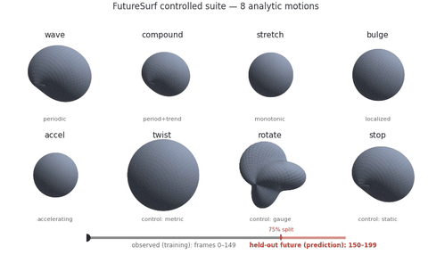

# FutureSurf: Future Rendering ≠ Future Surface

A benchmark for **future-time surface reconstruction**: given frames up to time *T*, how good is a method's reconstructed **mesh** at held-out *t > T*?

- 📄 **Paper:** `TODO`
- 🤗 **Data:** [rickyshi/futuresurf](https://huggingface.co/datasets/rickyshi/futuresurf)

## Videos

\
*The eight motions (GT meshes; the marker crosses the 75% observed/future split).*

## Layout
```
.
├── README.md            this file
├── BENCHMARK_CARD.md    intended use, claims, limits, licensing
├── FAQ.md               plain-language Q&A
├── LICENSE              code license (MIT)
├── dataset/
│   ├── README_DATASET.md   dataset layout
│   └── LICENSE             data license (CC BY 4.0)
├── eval/
│   ├── score.py            evaluate a method
│   └── gt_oracle.py        recoverability oracle
└── videos/              controlled_motions (GIF + MP4)
```

## Get the data
The dataset is on Hugging Face: **https://huggingface.co/datasets/rickyshi/futuresurf**
```python
from huggingface_hub import hf_hub_download
hf_hub_download("rickyshi/futuresurf", "futuresurf_dataset.zip", repo_type="dataset", local_dir=".")
```
Then `unzip futuresurf_dataset.zip` → `dataset/`.

## Controlled motions
Eight analytic motions of a textured sphere (`wave, compound, stretch, bulge, accel` + the `twist, rotate, stop` controls), 200 frames each, per-frame GT mesh, 150/50 observed/future split (`transforms_train.json` = `time ≤ 0.75`, `transforms_test.json` = `time > 0.75`).

## Dependencies
`numpy + scipy + trimesh`. Verified: Python 3.9, numpy 2.0.2, scipy 1.13.1, trimesh 4.12.2.

## Evaluate your method
Train on the observed window, extract one mesh per frame (`frame_0.ply … frame_199.ply`, rank-aligned by trailing index), then score:

```bash
python eval/score.py \
    --scene wave \
    --pred_dir my_pred/wave \
    --gt_dir dataset/controlled/wave/mesh_gt \
    --out results
```

Writes `results/gap_wave.json` with `future_mean_cd` (**primary score**), `observed_mean_cd`, and `gap_ratio_mean`/`median` (diagnostic; `1` = future as accurate as observed, `> 1` = worse). Repeat for the 8 motions.

**Coordinate frame.** Output meshes in the GT frame (Y-up, origin-centered); the scorer does no alignment.

## Inspect recoverability (optional)
`gt_oracle.py` fits simple extrapolators on the *ground-truth* trajectories, bounding how recoverable each future is. High recoverability + a large method gap ⇒ the failure is the backbone's, not an unknowable future.

```bash
python eval/gt_oracle.py \
    --data dataset/controlled \
    --out gtside_constructed.json
```

## License
- Constructed motions (renders, GT meshes, transforms): **CC BY 4.0** (`dataset/LICENSE`).
- Evaluation code: **MIT** (`LICENSE`).
